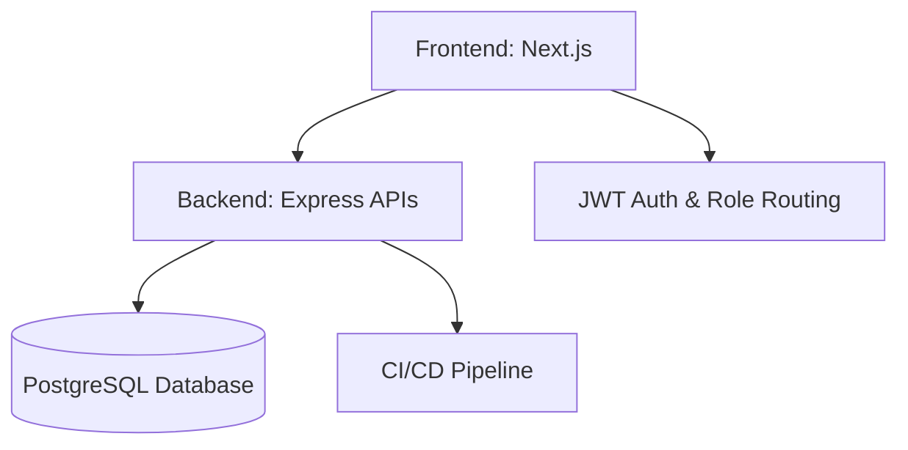

# Efforts Engineers — Industrial Compressor Spares & Overhaul Platform

<p align="center">
  <a href="docs/TEST_CASES.md">
    
  </a>
  <a href="effortsengineers-frontend">
    
  </a>
  <a href="app/global-reach">
    
  </a>
  <a href="package.json">
    
  </a>
</p>

---

## 📌 Executive Overview

**Efforts Engineers** (Pune, India) is an established platform specializing in **industrial compressor spares, overhaul services, and digital catalog solutions**.  
Our mission is to modernize procurement and service workflows with **Next.js dashboards, AI‑powered chatbots, and ISO‑certified quality standards**.

---

## ⚙️ Tech Stack

- **Frontend:** Next.js 16, TailwindCSS, JWT Auth, Role‑based Routing  
- **Backend:** Node.js 20+, Express 5, PostgreSQL  
- **Testing:** Jest (ESM/CJS compatibility), Supertest  
- **Deployment:** GitHub Pages (static export), CI/CD pipelines  
- **Quality:** ISO 9001:2015 compliance  

---

## 📂 Repository Structure

```text
efforts-engineers/
├── effortsengineers-frontend/   # Next.js frontend
├── effortsengineers-backend/    # Node.js + Express APIs
├── docs/                        # Documentation & test cases
├── app/                         # Global reach, dashboards
└── package.json                 # Node.js dependencies
```

## 🚀 Quick Start

```bash

# Clone repository
git clone https://github.com/effortsengineers/platform.git

# Navigate to frontend
cd effortsengineers-frontend

# Install dependencies
npm install

# Run development server
npm run dev
```

## 📖 Documentation Index

| Phase / Document | Title | Focus Areas |
| :--- | :--- | :--- |
| [Phase 1](docs/project_plan/phase1.md) | Project Initialization | Folder structure, dependencies, toolchain setup |
| [Phase 2](docs/project_plan/phase2.md) | Backend Architecture | Express 5, PostgreSQL, API design |
| [Phase 3](docs/project_plan/phase3.md) | Frontend Development | Next.js, Tailwind, role‑based routing |
| [Phase 4](docs/project_plan/phase4.md) | Integration | API consumption, dashboards, quotation builder |
| [Phase 5](docs/project_plan/phase5.md) | Deployment | GitHub Pages, CI/CD, static export |
| [Phase 6](docs/project_plan/phase6.md) | Testing & QA | Jest, Supertest, CI pipelines |
| [Phase 7](docs/project_plan/phase7.md) | Visual Roadmap | Diagrams, templates, team overview |

## 🧪 QA & Testing

- **Backend Tests:** 19/19 passed (100%)  
- **Frontend Pages:** 21 prerendered successfully  
- **CI/CD:** Automated builds and test pipelines  

---

## 🏗️ Architecture Diagram



## 📜 License & Contact

- **Company:** Efforts Engineers  
- **Location:** Pune, Maharashtra, India  
- **Contact:** info@effortsengineers.in | +91 98220 31096  
- **Proprietary Notice:** This project and its contents are proprietary to Efforts Engineers. Unauthorized distribution or copying is strictly prohibited.
