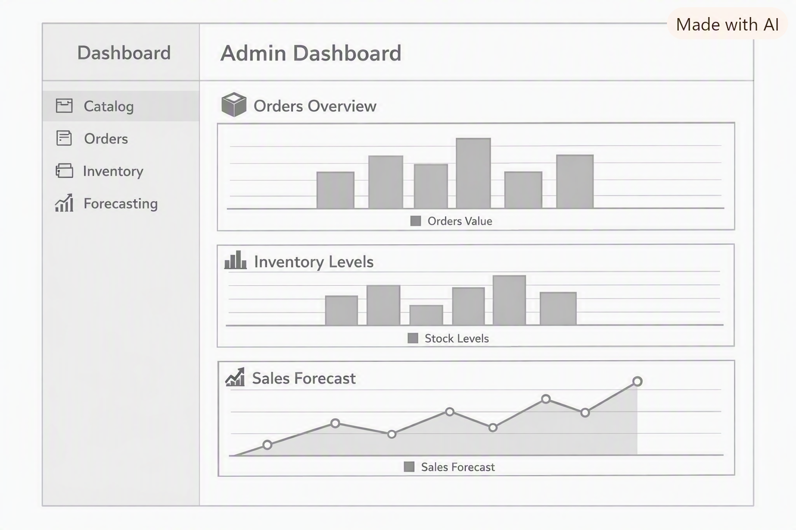
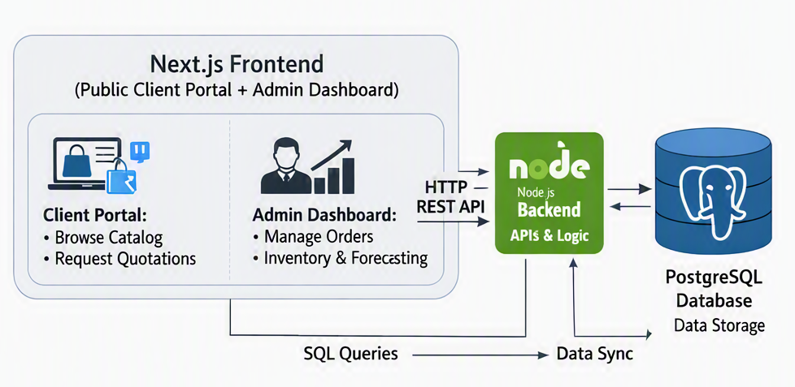
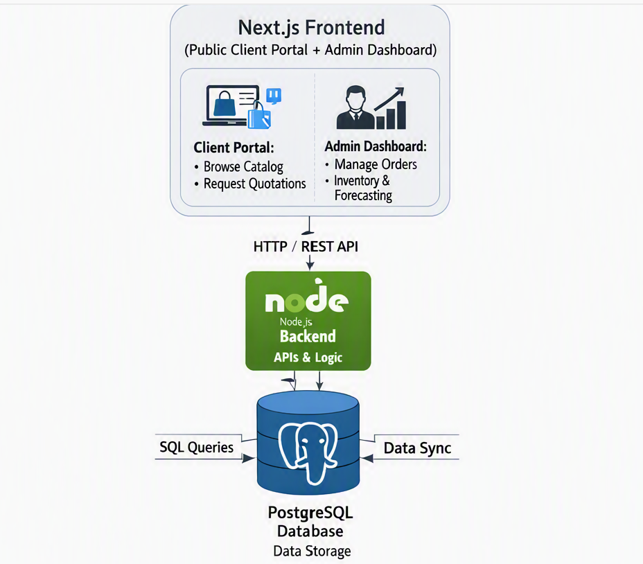
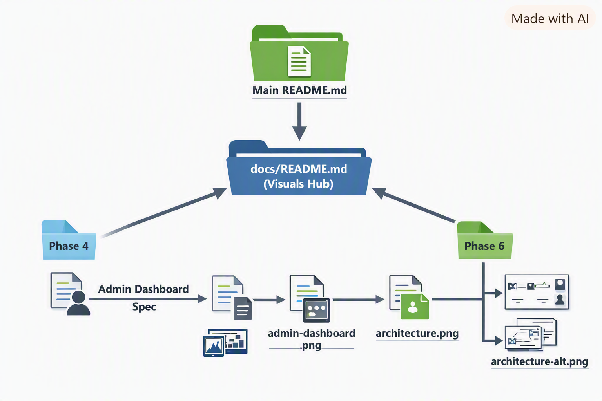

# 📊 Visuals & Specs – Efforts Engineers

This index helps both developers and designers quickly locate diagrams, screenshots, and their specifications without digging through phase files. This folder contains all **visual assets** and their **design specifications** for the Efforts Engineers platform.

---

## 📂 Visual Assets Summary

| Visual | Spec File | Used In |
|---------|------------|---------|
| dashboard-admin.png | admin-dashboard-spec.md | Phase 4 |
| architecture-horizontal.png | architecture-spec.md | Phase 6 |
| architecture-vertical.png | architecture-spec.md | Phase 6 |
| deployment-workflow.png | deployment-workflow-spec.md | Phase 5 |
| roadmap.png | roadmap-spec.md | Phase 7 |
| doc-flow.png | documentation-flow-spec.md | docs/README.md |

---

## 📊 Documentation Navigation Flow

The diagram below shows how documentation is organized:

- **Documentation Flow**
  - Diagram: [doc-flow.png](doc-flow.png)
  - Spec: [documentation-flow-spec.md](documentation-flow-spec.md)
  
**Flow:**
- Main README → docs/README (Visuals Hub)
- Phase 4 → Admin Dashboard Spec + Screenshot
- Phase 6 → Architecture Spec + Diagrams
- Specs → PNG files (dashboard-admin.png, architecture-horizontal.png, architecture-vertical.png)

📌 Note: `documentation-flow.png` is a meta-diagram showing how README, phase docs, specs, and PNGs are interconnected.

⚠️ Always update both the `.png` file and its corresponding `*-spec.md` when making design changes.

---

## 📸 Screenshots & Diagrams

- **Admin Dashboard**
  - Screenshot: [dashboard-admin.png](dashboard-admin.png)
  - Spec: [admin-dashboard-spec.md](admin-dashboard-spec.md)

- **System Architecture**
  - Diagram (Horizontal): [architecture-horizontal.png](architecture-horizontal.png)
  - Diagram (Vertical): [architecture-vertical.png](architecture-vertical.png)
  - Spec: [architecture-spec.md](architecture-spec.md)

- **Deployment Workflow**
  - Diagram: [deployment-workflow.png](deployment-workflow.png)
  - Spec: [deployment-workflow-spec.md](project_plan/deployment-workflow-spec.md)

- **Project Roadmap**
  - Diagram: [roadmap.png](roadmap.png)
  - Spec: [roadmap-spec.md](roadmap-spec.md)

---

## 🖼️ Visual Previews
 Admin Dashboard
 Architecture – Horizontal
 Architecture – Vertical
 Documentation Flow

---

## 🧩 Usage in Documentation

- **Phase 4 (`project_plan/phase4.md`)**
  - References `dashboard-admin.png` and `admin-dashboard-spec.md`

- **Phase 6 (`project_plan/phase6.md`)**
  - References `architecture-horizontal.png`, `architecture-vertical.png`, and `architecture-spec.md`

- **Main README (`../README.md`)**
  - Links to both visuals for quick overview

---

## 🎨 Design Notes
- All diagrams use **light theme**, clean sans‑serif fonts (Roboto/Open Sans).
- Icons:
  - 📦 Orders, 📊 Inventory, 📈 Forecast for dashboard
  - Node.js logo (green), PostgreSQL elephant (blue), laptop/user icons for architecture
- Layouts:
  - Dashboard → stacked charts or 2×2 grid
  - Architecture → horizontal and vertical flows for clarity

---

## 🔗 Back to Main Documentation
Return to the [Main README](../README.md) for phase‑wise project details.

---
_Last updated: September 2026_

