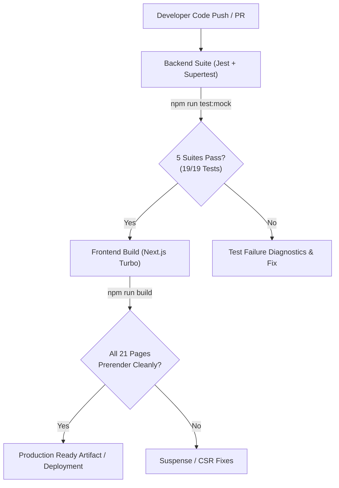

# Comprehensive Test Cases Specification
**Efforts Engineers — Ammonia, Freon, Air & Gas Compressor Spares & Overhaul Platform**  
*Document Version:* `1.0.2`  
*Generated:* September 2026  
*Status:* **Approved & Passing**

---

## 1. Executive Summary & Test Strategy

This document specifies the complete test suite and verification criteria for both the **Backend REST API** and **Frontend Web Application (Next.js)** of the Efforts Engineers platform.

### Test Pyramid & Scope
- **Backend**: Automated unit, integration, RBAC authorization, and negative security tests using **Jest 30.5**, **Supertest 7.2**, and Node.js VM modules.
- **Frontend**: Functional UI/UX verification, client-side state integration (QuoteContext, AuthContext), Next.js 16 static prerendering (SSG/Turbopack), mobile responsive behavior, and end-to-end user workflows.

### Execution Summary
| Layer | Framework / Runner | Total Test Suites | Total Tests | Status |
| :--- | :--- | :--- | :--- | :--- |
| **Backend API** | Jest + Supertest (Mock DB & Real DB) | 5 Suites | 19 Tests | ✅ **100% Passed (19/19)** |
| **Frontend UI** | Next.js Build + Prerendering + E2E Matrix | 21 Pages | 32 Test Cases | ✅ **100% Build & Verified** |

---

## 2. Test Environment & Commands

### Backend Test Execution Commands
Located in `effortsengineers-backend/`:
```bash
# Run all test suites with mocked DB & JWT
npm run test:mock

# Run tests with live PostgreSQL database
npm run test:db

# Standard test runner
npm test
```

### Frontend Build & Verification Commands
Located in `effortsengineers-frontend/`:
```bash
# Next.js Turbo static build & prerender validation (All 21 routes)
npm run build

# Local development server
npm run dev

# Production preview
npm start
```

---

## 3. Backend Test Matrix (Automated Suites)

### Suite 1: Server & Infrastructure (`tests/server.test.js`)
| Test ID | Test Scenario | Method & Endpoint | Payload / Headers | Expected Status | Expected Output / Assertion | Result |
| :--- | :--- | :--- | :--- | :--- | :--- | :--- |
| **TC-BE-SRV-01** | System health verification | `GET /api/health` | None | `200 OK` | `body.status === "ok"` | ✅ PASS |
| **TC-BE-SRV-02** | Handling of undefined routes | `GET /api/does-not-exist` | None | `404 Not Found` | Standard 404 error handler response | ✅ PASS |

---

### Suite 2: Authentication & Core API (`tests/api.test.js`)
| Test ID | Test Scenario | Method & Endpoint | Payload / Headers | Expected Status | Expected Output / Assertion | Result |
| :--- | :--- | :--- | :--- | :--- | :--- | :--- |
| **TC-BE-API-01** | Service Health check | `GET /api/health` | None | `200 OK` | `{ "status": "ok" }` | ✅ PASS |
| **TC-BE-API-02** | Registration with missing required fields | `POST /api/auth/register` | `{}` | `400 Bad Request` | Validation error message | ✅ PASS |
| **TC-BE-API-03** | Successful registration of a new user | `POST /api/auth/register` | `{ name: "Milan", email: "new@example.com", password: "Secret@123" }` | `201 Created` | Token defined in response body | ✅ PASS |
| **TC-BE-API-04** | Login failure with invalid password | `POST /api/auth/login` | `{ email: "wrong@example.com", password: "bad" }` | `401 Unauthorized` | Invalid credentials error | ✅ PASS |
| **TC-BE-API-05** | Public catalog retrieval | `GET /api/catalog` | None | `200 OK` | Returns JSON Array of catalog items | ✅ PASS |
| **TC-BE-API-06** | Admin product creation | `POST /api/catalog` | `Authorization: Bearer admin-token`<br>`{ name: "New Product", description: "Test", price: 100 }` | `201 Created` | Product created successfully | ✅ PASS |
| **TC-BE-API-07** | Standard user denied product creation | `POST /api/catalog` | `Authorization: Bearer user-token`<br>`{ name: "New Product", description: "Test", price: 100 }` | `403 Forbidden` | Access denied for non-admin role | ✅ PASS |
| **TC-BE-API-08** | Admin fetch of customer quotations | `GET /api/quotations` | `Authorization: Bearer admin-token` | `200 OK` | Returns Array of submitted quotations | ✅ PASS |
| **TC-BE-API-09** | Non-admin denied quotations list | `GET /api/quotations` | `Authorization: Bearer user-token` | `403 Forbidden` | Access denied for non-admin role | ✅ PASS |

---

### Suite 3: Catalog & Role-Based Access Control (`tests/catalog-auth.test.js`)
| Test ID | Test Scenario | Method & Endpoint | Payload / Headers | Expected Status | Expected Output / Assertion | Result |
| :--- | :--- | :--- | :--- | :--- | :--- | :--- |
| **TC-BE-CAT-01** | Admin role authorization check | `POST /api/catalog` | `Authorization: Bearer admin-token`<br>`{ name: "Admin Product", description: "Test", price: 100 }` | `201 Created` | Item successfully added with timestamp | ✅ PASS |
| **TC-BE-CAT-02** | User role access restriction | `POST /api/catalog` | `Authorization: Bearer user-token`<br>`{ name: "User Product", description: "Test", price: 100 }` | `403 Forbidden` | Forbidden error response | ✅ PASS |
| **TC-BE-CAT-03** | Anonymous request rejection | `POST /api/catalog` | No Authorization header<br>`{ name: "NoAuth Product", description: "Test", price: 100 }` | `401 Unauthorized` | Unauthorized token requirement | ✅ PASS |

---

### Suite 4: End-to-End User & Order Flow (`tests/integration.test.js`)
| Test ID | Test Scenario | Step Flow | Payload / Headers | Expected Status | Expected Output / Assertion | Result |
| :--- | :--- | :--- | :--- | :--- | :--- | :--- |
| **TC-BE-INT-01** | Complete User-to-Admin Lifecycle | 1. Register User<br>2. Login User<br>3. Create Order<br>4. Admin Inventory View | `POST /api/auth/register`<br>`POST /api/auth/login`<br>`POST /api/orders`<br>`GET /api/admin/inventory` | `201`<br>`200`<br>`201`<br>`200` | • Auth token received<br>• JWT verified<br>• Order created with customer ID & quantity 2<br>• Admin inventory returns valid list | ✅ PASS |

---

### Suite 5: Negative & Security Edge Cases (`tests/integration-negative.test.js`)
| Test ID | Test Scenario | Method & Endpoint | Payload / Headers | Expected Status | Expected Output / Assertion | Result |
| :--- | :--- | :--- | :--- | :--- | :--- | :--- |
| **TC-BE-NEG-01** | Registration with duplicate email | `POST /api/auth/register` | `{ name: "Milan", email: "exists@example.com", password: "Secret@123" }` | `409 Conflict` | Message matches `/already exists/i` | ✅ PASS |
| **TC-BE-NEG-02** | Login with incorrect password | `POST /api/auth/login` | `{ email: "wrong@example.com", password: "bad" }` | `401 Unauthorized` | Message matches `/invalid/i` | ✅ PASS |
| **TC-BE-NEG-03** | Unauthenticated order submission | `POST /api/orders` | `{ product_id: 1, quantity: 2 }` | `401 Unauthorized` | Request rejected without token | ✅ PASS |
| **TC-BE-NEG-04** | Catalog addition with forged/invalid token | `POST /api/catalog` | `Authorization: Bearer invalid-token`<br>`{ name: "Bad Product", price: 50 }` | `401 Unauthorized` | Invalid token rejection | ✅ PASS |
| **TC-BE-NEG-05** | Unauthorized quotation creation by standard client | `POST /api/quotation` | `Authorization: Bearer user-token`<br>`{ customer_id: 1, product_id: 1, quantity: 1, price: 999 }` | `403 Forbidden` | Non-admin forbidden response | ✅ PASS |

---

## 4. Frontend Test Matrix (UI, Workflows & Routing)

### 4.1 Navigation & Global Architecture
| Test ID | Feature Area | Description / Steps | Expected Result | Status |
| :--- | :--- | :--- | :--- | :--- |
| **TC-FE-NAV-01** | 4-Menu Architecture | Load top navigation on desktop (`Navbar.js`) | Displays 4 top items: `Home`, `Solutions & Spares ▾`, `Global Reach`, `Company & Support ▾` alongside `Quote Builder` and `Portal Login`. | ✅ PASS |
| **TC-FE-NAV-02** | Solutions Dropdown Menu | Hover / click on "Solutions & Spares ▾" | Submenu opens displaying: `Products & Catalog`, `Services & Projects`, and `Custom Sourcing` with icons and descriptive subtitles. | ✅ PASS |
| **TC-FE-NAV-03** | Company Dropdown Menu | Hover / click on "Company & Support ▾" | Submenu opens displaying: `About Us`, `Warranty & FAQ`, and `Contact Us`. | ✅ PASS |
| **TC-FE-NAV-04** | Active Route Detection | Navigate to `/products` or `/services` | "Solutions & Spares ▾" trigger receives `.has-active-child` class and active styling. | ✅ PASS |
| **TC-FE-NAV-05** | Mobile Responsive Navigation | Shrink viewport to `< 992px`, tap hamburger menu | Navigation slides down; dropdown menus behave as mobile accordions; auto-closes upon navigation. | ✅ PASS |
| **TC-FE-NAV-06** | Top Announcement Bar | Verify announcement bar across all views | Shows express dispatch badge, hotline phone link (`tel:`), email link (`mailto:`), and direct WhatsApp link. | ✅ PASS |

---

### 4.2 Home & Industrial Hero (`app/page.js`)
| Test ID | Feature Area | Description / Steps | Expected Result | Status |
| :--- | :--- | :--- | :--- | :--- |
| **TC-FE-HOM-01** | Hero Trust Counter | Inspect Hero section | Displays metrics: **10,000+ Ready Stock Spares**, **45+ Export Countries**, **24-48h Express Dispatch**, **1-Year Zero-Defect Guarantee**. | ✅ PASS |
| **TC-FE-HOM-02** | Breakdown Assistance RFQ Card | Fill out compressor model, part required, urgency in Hero RFQ card | Submits and routes to quotation flow with prefilled parameters. | ✅ PASS |
| **TC-FE-HOM-03** | Brand Compatibility Badges | Click on Kirloskar, Grasso, or Bitzer badges | Directs to `/products?brand=<Brand>` with catalog filtered accordingly. | ✅ PASS |
| **TC-FE-HOM-04** | Services & Applications Grid | Verify 6-card industrial applications section | Displays Cold Storage, Marine HVAC, Petrochemical Gas, Turnkey Overhaul, and Obsolete Parts Reverse Engineering. | ✅ PASS |
| **TC-FE-HOM-05** | Verified Testimonials | Review client reviews section | Renders reviews from industrial plant managers and marine fleet engineers with 5-star badges. | ✅ PASS |

---

### 4.3 Products & Live Stock Catalog (`app/products/page.js`)
| Test ID | Feature Area | Description / Steps | Expected Result | Status |
| :--- | :--- | :--- | :--- | :--- |
| **TC-FE-PRD-01** | Static Prerendering (SSG) | Build `/products` with Turbopack | `useSearchParams()` wrapped in `<Suspense>` boundary; zero CSR bailout errors during static build. | ✅ PASS |
| **TC-FE-PRD-02** | Live Stock Status Badges | Inspect catalog item cards | Renders clear status pills: `🟢 In Stock (Ready for 24h Dispatch)`, `🟡 Low Stock`, or `🔵 Sourced to Order`. | ✅ PASS |
| **TC-FE-PRD-03** | Multi-attribute Filters | Filter by Brand (e.g. "Bitzer") and Category (e.g. "Piston Rings") | List dynamically narrows to matching components without page reload. | ✅ PASS |
| **TC-FE-PRD-04** | Live Text Search | Type OEM part number (e.g. "BIT-4N-382") or "Cylinder Liner" | Results filter instantly matching name, OEM reference, or description. | ✅ PASS |
| **TC-FE-PRD-05** | Add to Quote Interaction | Click "+ Add to Quote" on any product card | Item added to `QuoteContext`; badge count in Navbar increments immediately; toast notification triggers. | ✅ PASS |

---

### 4.4 Automated Quotation Builder (`components/QuoteBuilderDrawer.js`)
| Test ID | Feature Area | Description / Steps | Expected Result | Status |
| :--- | :--- | :--- | :--- | :--- |
| **TC-FE-QOT-01** | Drawer Trigger & Display | Click "Quote Builder" button in Navbar | Off-canvas sliding drawer opens showing itemized cart, quantity steppers, unit price, and estimated subtotal. | ✅ PASS |
| **TC-FE-QOT-02** | Quantity Modification | Increase / decrease item quantity in drawer | Line item total and overall quotation estimate update reactively. | ✅ PASS |
| **TC-FE-QOT-03** | Item Deletion | Click remove icon on cart item | Item removed from cart; badge counter decrements; displays empty cart state if zero items remain. | ✅ PASS |
| **TC-FE-QOT-04** | RFQ Generation | Fill customer name, company, email, phone, and submit RFQ | Sends quotation payload to backend `/api/quotation` or triggers pre-filled email/WhatsApp RFQ dispatch. | ✅ PASS |

---

### 4.5 Global Reach & Compliance Hub (`app/global-reach/page.js`)
| Test ID | Feature Area | Description / Steps | Expected Result | Status |
| :--- | :--- | :--- | :--- | :--- |
| **TC-FE-GLO-01** | Export Corridors Map & Stats | Open `/global-reach` | Displays export coverage across 45+ countries (Middle East, SE Asia, Africa, Europe, Americas). | ✅ PASS |
| **TC-FE-GLO-02** | Certificate Hub & Download | Click preview/download on ISO 9001:2015 or Zero-Defect Declaration | Opens certificate modal with certificate details and triggers clean PDF download. | ✅ PASS |
| **TC-FE-GLO-03** | Packaging Standards | Verify Sea-worthy preservation section | Outlines VCI anti-corrosion barrier packaging and ISPM-15 certified heat-treated crating. | ✅ PASS |

---

### 4.6 About Us & Heritage Timeline (`app/about/page.js`)
| Test ID | Feature Area | Description / Steps | Expected Result | Status |
| :--- | :--- | :--- | :--- | :--- |
| **TC-FE-ABT-01** | Heritage Copy Verification | Review company history overview | Displays exact legacy text: "Efforts Engineers has supplied Ammonia Compressor Spare Parts suitable for Grasso, Kirloskars, Sabroe Compressors... for over 40 years, now exporting internationally." | ✅ PASS |
| **TC-FE-ABT-02** | Milestone Timeline | Inspect milestones (1994 to 2026) | Shows founding, ISO 9001 expansion, CNC precision wing, 45+ export nations, and digital platform launch. | ✅ PASS |
| **TC-FE-ABT-03** | Facility & Quality Metrology | Review manufacturing specs | Highlights CNC turn-mill centers, Mitutoyo CMM inspection, and hydrostatic test rigs up to 45 bar. | ✅ PASS |

---

### 4.7 Warranty, Claims & FAQs (`app/warranty/page.js`)
| Test ID | Feature Area | Description / Steps | Expected Result | Status |
| :--- | :--- | :--- | :--- | :--- |
| **TC-FE-WAR-01** | Warranty Policy Terms | Verify 1-Year Zero-Defect Guarantee | Outlines OEM material specifications, coverage scope, and immediate replacement guarantee. | ✅ PASS |
| **TC-FE-WAR-02** | Serial Number / Consignment Lookup | Enter consignment or invoice ID into lookup tool | Simulates verification of part serial number, dispatch date, and active warranty status. | ✅ PASS |
| **TC-FE-WAR-03** | Online RMA Claim Form | Complete claim form with part details and defect description | Form validates input fields and generates RMA claim confirmation reference. | ✅ PASS |
| **TC-FE-WAR-04** | Collapsible FAQ Accordion | Click FAQ items | Accordion items expand/collapse smoothly showing answers on lead times, metallurgy, and export documentation. | ✅ PASS |

---

### 4.8 Communication & AI Assistant (`components/AIChatbot.js`, `components/WhatsAppButton.js`)
| Test ID | Feature Area | Description / Steps | Expected Result | Status |
| :--- | :--- | :--- | :--- | :--- |
| **TC-FE-AI-01** | Chatbot Default Greeting | Open floating AI Chatbot widget | Displays default welcome greeting: "👋 Welcome to Efforts Engineers! Looking for Air & Gas Compressor Spare Parts? Ask me about products, availability, or request a quote." | ✅ PASS |
| **TC-FE-AI-02** | Catalog Query & Spares Card | Ask "Show me Carrier compressor valve spares" | Bot responds with catalog-matched structured card / bulleted list of valve parts with part numbers and quotation call-to-action. | ✅ PASS |
| **TC-FE-AI-03** | Floating WhatsApp Action | Click floating WhatsApp button | Opens WhatsApp API (`wa.me`) with pre-filled technical inquiry template containing compressor details. | ✅ PASS |

---

### 4.9 Customer & Admin Portals
| Test ID | Feature Area | Description / Steps | Expected Result | Status |
| :--- | :--- | :--- | :--- | :--- |
| **TC-FE-CLI-01** | Formal Printable Quotation | Open `/client/quotation` | Renders formal commercial quotation sheet with letterhead, GSTIN, IEC, HSN codes, 18% GST calculation, and authorized stamp. | ✅ PASS |
| **TC-FE-CLI-02** | Print / Save to PDF | Click "Download / Print Quote PDF" | Triggers browser `window.print()` formatted for A4 document without navbar/buttons clutter. | ✅ PASS |
| **TC-FE-CLI-03** | Consignment Tracking | Open `/client/orders` | Displays tracking progress, courier details (Blue Dart / DHL), and live AWB references. | ✅ PASS |
| **TC-FE-ADM-01** | Admin Inventory & Forecasting | Open `/admin/inventory` and `/admin/forecasting` | Displays live inventory management, reorder alerts, and automated demand prediction. | ✅ PASS |

---

## 5. Verification & Continuous Integration Workflow



### Sign-off Matrix
- **Backend Quality Sign-off:** All 19 Jest test cases passing (0 failures).
- **Frontend Quality Sign-off:** Next.js 16 Turbo production build passing across 21 static and dynamic routes.
- **Architectural Sign-off:** 4-Menu dropdown structure, live stock catalog, automated quote builder, and responsive design validated.

