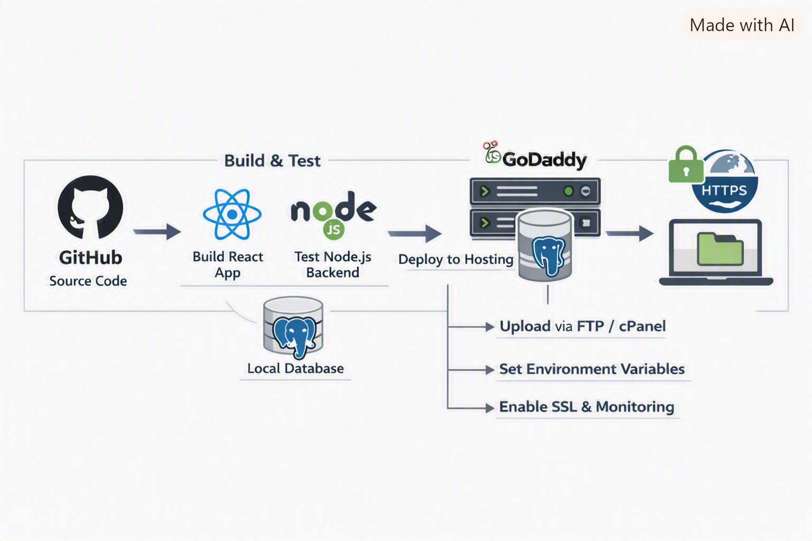

# 🚀 Phase 5 – Deployment

This phase uses one supported production topology: Render for the backend, managed PostgreSQL for the database, and Vercel for the Next.js frontend.

---

## 📋 Pre‑Requisites
- Completed backend setup (Node.js + Express + PostgreSQL)
- Completed frontend setup (Next.js + API integration)
- Environment variables configured (`.env` file with DB credentials, API keys, and JWT secrets)
- Production build tested locally

---

## 🛠️ Steps to Deploy

### 1. Backend Deployment on Render
- Connect the GitHub repository and deploy the `effortsengineers-backend` directory.
- Build command: `npm install`
- Start command: `npm start`
- Configure `PORT`, `CORS_ORIGIN`, `DATABASE_URL`, and JWT secrets in Render.
- Set a health check for `/api/health` and deploy only from the protected `main` branch.

### 2. Managed PostgreSQL
- Create one production database and one non-production database.
- Apply schema changes through versioned migration scripts, not ad hoc production queries.
- Require TLS, a least-privilege application user, automated backups, and a documented restore test.

### 3. Frontend Deployment on Vercel
- Connect the frontend directory to Vercel.
- Build command: `npm run build`.
- Configure `NEXT_PUBLIC_API_URL` with the HTTPS Render API URL.
- Verify that the production origin is the only allowed CORS value.

---

## 🔒 Security & Best Practices
- Use HTTPS (SSL certificates via Let’s Encrypt or managed hosting).
- Allow only the Vercel production origin and approved preview origins in CORS.
- Set `withCredentials` only when cookie-based auth is enabled.
- Store secrets in environment variables, not code.
- Enable database backups and monitoring.
- Apply role-based access control for admin vs client access.

---

## 📊 Monitoring & Logging
- Use **PM2 logs** or **Winston** for backend logging.
- Enable error tracking (Sentry or similar).
- Monitor uptime with services like UptimeRobot.
- Use pgAdmin or cloud monitoring for PostgreSQL health.

## ✅ Release checks

1. Run backend test checks with `npm test` or `npm run test:db` when DB validation is needed.
2. Run frontend production build with `npm run build`.
3. Verify `GET /api/health` and one authenticated API smoke test.
4. Confirm database migrations and backup restore in staging.
5. Confirm HTTPS, CORS, cookie flags, and logs contain no secrets.

---

## 📸 Visual Reference
Refer to the deployment workflow diagram:

---

## ✅ Deliverables
- Backend deployed and accessible via HTTPS.
- Frontend deployed and connected to the backend API.
- PostgreSQL database live and secured.
- Deployment workflow documented with diagram.

