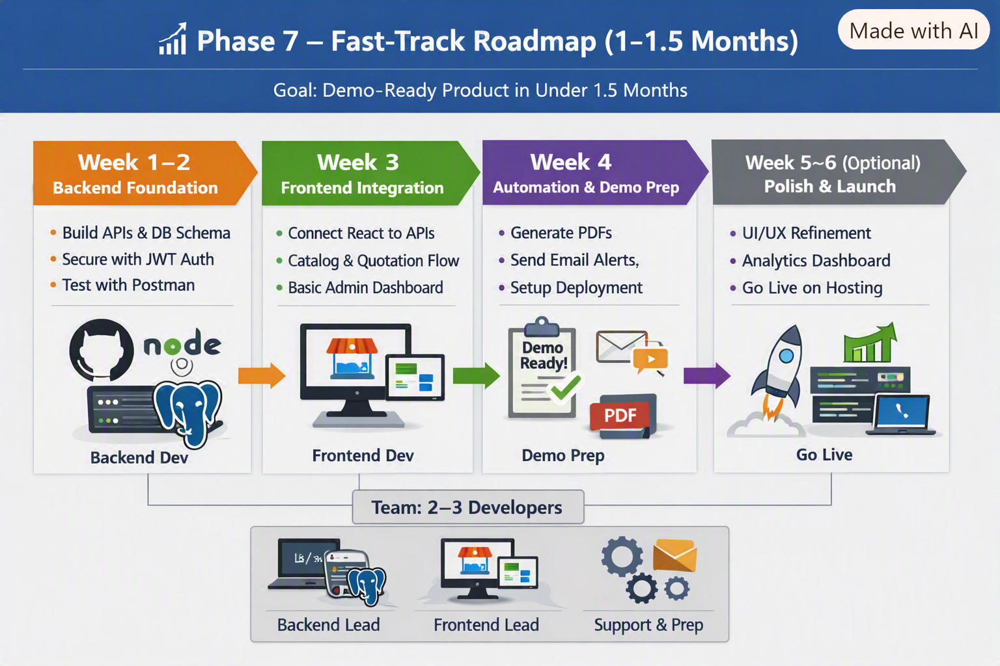

# 📈 Phase 7 – Fast‑Track Roadmap (1–1.5 Months)

This phase provides a compressed roadmap to deliver a demo‑ready product quickly, with 2–3 developers working in parallel. The goal is to complete core development within 1 month so the owner can see a working demo.

| Week | Focus Area | Key Tasks | Team |
|------|-------------|-----------|------|
| 1–2 | Backend Foundations | APIs, DB schema, JWT auth, Postman tests | Backend Lead |
| 3 | Frontend Integration | React + API link, Catalog flow, Admin Dashboard | Frontend Lead |
| 4 | Automation & Demo Prep | PDF generation, Email alerts, Deployment setup | Support/DevOps |
| 5–6 (Optional) | Polish & Launch | UI/UX, Analytics dashboard, Render/Vercel launch | All |

---

## 🗓️ Timeline

- **Week 1–2: Backend Foundations**
  - Finalize PostgreSQL schema (products, quotations, orders, users).
  - Build core REST APIs (CRUD for catalog, quotations, orders).
  - Secure endpoints with JWT authentication.
  - Test APIs locally with Postman.

- **Week 3: Frontend Integration**
  - Connect React frontend to backend APIs.
  - Implement catalog browsing + quotation request flow.
  - Build basic Admin Dashboard (orders + inventory view).
  - Ensure role‑based access (Client vs Admin).

- **Week 4: Automation & Demo Prep**
  - Add PDF generation for quotations.
  - Enable email notifications (Nodemailer).
  - Prepare deployment pipeline (GitHub → Render/Vercel).
  - Internal demo build ready by end of week.

- **Week 5–6 (Optional buffer if 1.5 months)**
  - Polish UI/UX.
  - Add analytics dashboard skeleton.
  - Deploy to Render/Vercel for live demo.

---

## 👥 Team Setup
- **Backend Lead:** Node.js + PostgreSQL schema & APIs  
- **Frontend Lead:** React integration with APIs  
- **Support/DevOps:** Automation, deployment prep  

---

## 📸 Visual Reference
Refer to roadmap diagram:  

---

## ✅ Deliverables
- Roadmap documentation (`phase7.md`).
- Roadmap diagram (`roadmap.png`) + spec file (`roadmap-spec.md`).
- Demo‑ready build by end of Week 4.
- Updated references in `docs/README.md`.

---

_Last updated: September 2026_
